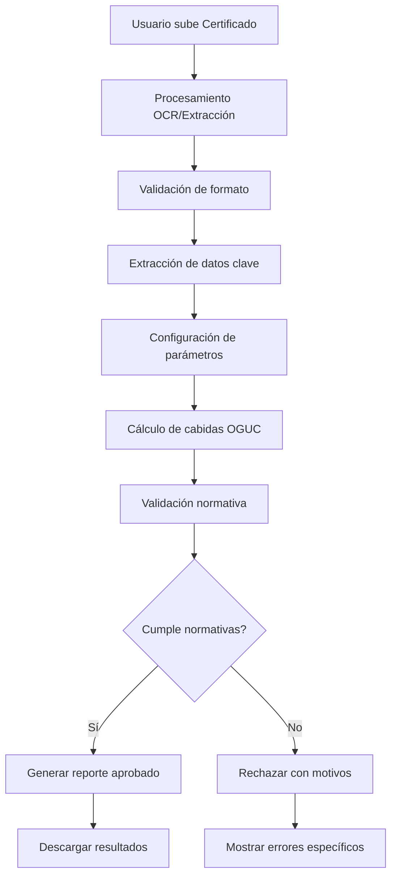

# Plan de Proyecto: Sistema Automatizado de Cálculo de Cabidas OGUC

## Objetivo
Desarrollar un sistema que procese Certificados de Informaciones Previas chilenos, calcule cabidas según normativa OGUC y valide cumplimiento normativo.

## Arquitectura del Sistema

### 1. Módulo de Entrada de Datos
- **Procesamiento de PDF/Imagen**: Extraer datos estructurados desde certificados
- **Validación de formato**: Verificar autenticidad y estructura del documento
- **OCR integrado**: Para documentos no estructurados

### 2. Motor de Cálculo OGUC
- **Parámetros configurables**: 
  - Superficie mínima por piso
  - Coeficiente de constructibilidad
  - Altura máxima permitida
  - Porcentaje de ocupación de suelo
- **Cálculos automáticos**:
  - Cabida de edificación
  - Superficie emplazamiento
  - Altura de edificación máxima
  - Densidades permitidas

### 3. Sistema de Validación Normativa
- **Base de datos OGUC**: Reglas actualizadas
- **Validaciones locales**: Planos reguladores municipales
- **Reglas de rechazo**:
  - Superficie inferior a mínimos legales
  - Altura excedida
  - Coeficiente de constructibilidad superado
  - Uso de suelo no permitido

### 4. Interfaz de Usuario
- **Upload de certificados**: Arrastrar y soltar archivos
- **Configuración de parámetros**: Formulario dinámico
- **Resultados en tiempo real**: Visualización de cálculos
- **Reportes descargables**: PDF con análisis completo

## Flujo de Trabajo



## Tecnologías Propuestas

### Backend
- **Python 3.9+**: Lenguaje principal
- **FastAPI**: Framework web para API REST
- **PyMuPDF**: Procesamiento de PDFs
- **pytesseract**: OCR para imágenes
- **pandas**: Manejo de datos tabulares
- **reportlab**: Generación de PDFs

### Frontend
- **React.js**: Interfaz de usuario
- **Material-UI**: Componentes visuales
- **Dropzone.js**: Upload de archivos
- **Chart.js**: Visualización de resultados

### Base de Datos
- **SQLite**: Para desarrollo inicial
- **PostgreSQL**: Para producción

## Estructura del Proyecto

```
arquitect-assistant/
├── backend/
│   ├── app/
│   │   ├── api/
│   │   │   ├── upload.py
│   │   │   ├── calculate.py
│   │   │   └── validate.py
│   │   ├── core/
│   │   │   ├── oguc_calculator.py
│   │   │   ├── pdf_processor.py
│   │   │   └── validator.py
│   │   ├── models/
│   │   │   ├── certificate.py
│   │   │   └── calculation.py
│   │   └── database.py
│   ├── requirements.txt
│   └── main.py
├── frontend/
│   ├── src/
│   │   ├── components/
│   │   │   ├── Upload.js
│   │   │   ├── Parameters.js
│   │   │   └── Results.js
│   │   ├── services/
│   │   │   └── api.js
│   │   └── App.js
│   ├── package.json
│   └── public/
├── docs/
│   ├── oguc_rules.md
│   └── api_documentation.md
└── tests/
    ├── test_calculator.py
    ├── test_processor.py
    └── test_validator.py
```

## Fases de Desarrollo

### Fase 1: MVP (2-3 semanas)
- Extracción básica de datos desde PDFs
- Motor de cálculo OGUC fundamental
- Validación simple de normativas
- Interfaz básica de upload y resultados

### Fase 2: Mejoras (2 semanas)
- OCR avanzado para documentos no estructurados
- Base de datos completa de normativas
- Interfaz mejorada con visualizaciones
- Reportes detallados

### Fase 3: Producción (1 semana)
- Optimización de rendimiento
- Manejo de errores robusto
- Documentación completa
- Despliegue en producción

## Criterios de Validación

### Reglas OGUC Clave
1. **Superficie mínima**: 40m² para vivienda unifamiliar
2. **Altura máxima**: Según zona y plano regulador
3. **Coeficiente constructibilidad**: 0.5 a 2.0 según zona
4. **Ocupación suelo**: Máximo 60-80% según normativa

### Motivos de Rechazo Automático
- Formato de certificado inválido
- Datos incompletos o ilegibles
- Superficie inferior a mínimos legales
- Parámetros fuera de rangos permitidos
- Inconsistencias en datos geográficos

## Entregables

1. **API REST** para procesamiento y cálculo
2. **Interfaz web** responsive y accesible
3. **Documentación técnica** y de usuario
4. **Tests automatizados** con >80% cobertura
5. **Reportes PDF** con análisis completo
6. **Base de datos** de normativas actualizables

## Métricas de Éxito

- **Precisión**: >95% en extracción de datos
- **Velocidad**: <30 segundos por procesamiento
- **Confiabilidad**: <1% falsos positivos/negativos
- **Usabilidad**: <3 clics para obtener resultados
- **Disponibilidad**: 99.5% uptime en producción
